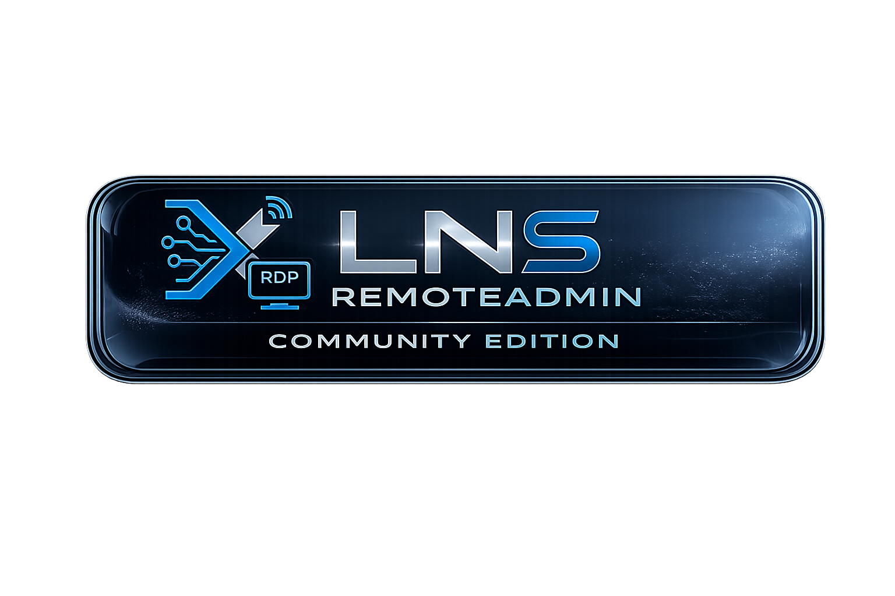
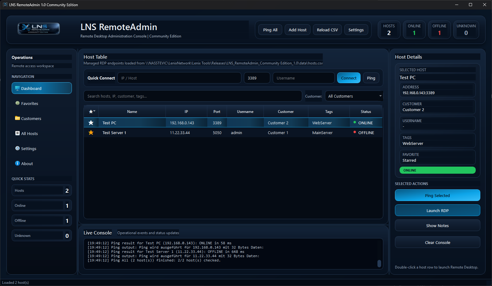

# LNS RemoteAdmin - Community Edition

<p align="center">
  
</p>

<p align="center">
Modern Remote Desktop Administration Console for Windows IT Professionals, MSPs and Power Users.
</p>

---

# Features

* Modern premium dark Lenix UI
* Multi-host RDP management
* Quick Connect
* Ping Selected / Ping All
* Favorites / Star Hosts
* Customer filtering
* Search functionality
* CSV-based host management
* Host notes support
* Live console logging
* System tray integration
* Per-host RDP settings
* Portable standalone EXE build
* Community Edition

---

# Screenshots

## Main Dashboard


<p align="center">
  
</p>

---

## Quick Connect & Toolbar


---

## Host Editing


---

## RDP Settings


---

## Application Settings


---

## About Dialog


---

# Quick Start

## Windows Portable Release

1. Download the latest release
2. Extract the ZIP archive
3. Start:

```text
LNS_RemoteAdmin.exe
```

---

# Data Storage

Hosts are stored inside:

```text
data/hosts.csv
```

Settings are stored inside:

```text
data/settings.json
```

---

# Community Edition

LNS RemoteAdmin Community Edition is provided free of charge for:

* Personal use
* Educational use
* Commercial/internal company use

---

# Technology

* Python 3
* PyQt6
* Windows Remote Desktop (mstsc.exe)
* Portable standalone EXE build

---

# Planned Features

* SSH integration
* Wake-on-LAN
* Monitoring improvements
* Session templates
* Remote tools integration
* Installer package
* Professional Edition
* Enterprise Edition

---

# Website

https://www.lenix.at

---

# GitHub

https://github.com/LenixNetwork/

---

# Social Media

## Instagram

https://www.instagram.com/lenixnetworksolutions

## Facebook

https://www.facebook.com/LenixNetworkSolutions

## YouTube

https://www.youtube.com/@LenixNetworkSolutions

---

# Contact

E-Mail:
[info@lenix.at](mailto:info@lenix.at)

---

# License

See:
LICENSE.txt

---

# Author

Created by:

**Lenix Network Solutions e.U.**
Stevic Vladan

---

# Disclaimer

This software is provided "AS IS" without warranty of any kind.

Use at your own risk.

---

<p align="center">
(c) 2026 Lenix Network Solutions e.U.
</p>
